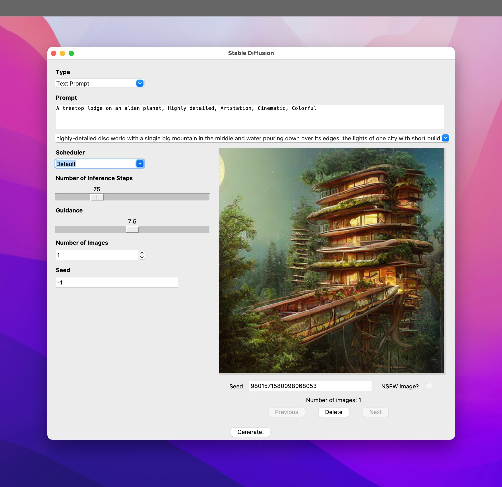

# Stable Diffusion for Apple Silicon

This repo is my work on getting Stable Diffusion working on Apple Silicon macs by keeping things as simple as possible. The requirements are kept as simple as possible and probably the most complicated thing is the GUI which allows you to set up all your image generation parameters on a GUI whether you are on a Mac, Linux, or Windows.

**Note:** All development has been done on an Apple Silicon Mac and this has been optimized for Apple Silicon. It does work on an Intel Mac too but look at the Installation Errors section below below for help if things go wrong with the installation. Also, on a 2017 MacBook Pro, it took about 40 minutes to generate a single image! No testing has been done on any other platform (Windows and Linux) but it should (theoretically) work on other platforms too.



The GUI has the following functionality:

* You can choose between generating via just a text prompt or a text + image prompt
* You can specify the size of the image that you want to generate
* Remembers the last settings (and prompt) you used the next time you run the script
* Remembers your last 20 prompts and allows you to select an old prompt via the history list
* Has the ability to switch between multiple schedulers to compare generated images
* Can generate more than one image at a time and allows you to view all generated images in the GUI
* Saves all generated images and the accompanying prompt info to hard drive
* Allows you to delete any image and its prompt info from the GUI itself
* Shows you the seed for any image so that you can use that seed to generate image variants

## Installation

You will need the following:

* An Apple Silicon or Intel mac (has not been tested on anything else)
* macOS 12.3 Monterey or later
* Python

Before you start your installation, you might also want to sign up at [Hugging Face](https://huggingface.co/) since you'll need a Hugging Face user account in order to download the Stable Diffusion models. Do note also that you would need to visit the [Hugging Face Stable Diffusion model page](https://huggingface.co/CompVis/stable-diffusion-v1-4) and accept their license before you would be able to download the model — you'll need to download the model during the installation.

There's also an [Installation Errors](#installation-errors) section further down. Please refer to that if you run into issues since common issues that others have faced are documented there 🙂

To get set up, you'll need to run the following commands in terminal one at a time. Do note that some of these commands would require you to make decisions and respond to prompts. If you are not comforable with that, this process might not be for you 🙂

There is some limited information which might help you in this blog post, but that too doesn't go into a lot of detail: https://write.farook.org/adventures-in-imagineering-mining-the-apple-silicon/

**Note:** Make sure you are in the folder location where you want to have this repo before you start running the following commands.

```bash
# install Homebrew
/bin/bash -c "$(curl -fsSL https://raw.githubusercontent.com/Homebrew/install/HEAD/install.sh)"

# Install miniconda to manage your Python environments
/bin/bash -c "$(curl -fsSL https://repo.anaconda.com/miniconda/Miniconda3-latest-MacOSX-x86_64.sh)"
# If the above line does not work to install miniconda correctly (some have reported issues) try the instructions at this link instead: https://docs.conda.io/projects/conda/en/latest/user-guide/install/macos.html

# Create and activate new conda environment named ml
conda create -n ml python=3.8
conda activate ml

# Install the needed Python packages
conda install pytorch torchvision torchaudio -c pytorch-nightly
conda install transformers
conda install -c conda-forge diffusers
conda install ftfy

# Install git and git-lfs via Homebrew
brew install git git-lfs

# Clone this repo and create output folder
git clone git@github.com:FahimF/sd-gui.git
cd sd-gui
mkdir output

# Clone the Hugging Face model repo - you will need the Hugging Face user and password for this step
git lfs install
git clone https://huggingface.co/CompVis/stable-diffusion-v1-4
```

If all of the above worked correctly and there were no issues, then you should be set 🙂

If you are still at the terminal, simply type the following to launch the UI:

```
python gui.py
```

If you closed the terminal or want to use the UI at some other point, you'd have to navigate back to where you have this repo (`sd-gui`) before you run the above command.

### Installation Errors

* If you get a Homebrew error like this: `homebrew-core is a shallow clone` then run the following command in terminal:

  ```bash
  git -C /usr/local/Homebrew/Library/Taps/homebrew/homebrew-core fetch --unshallow
  ```

* During the conda install it should prompt you to update your system settings to add the conda installation path to your system path. If you didn't do this, then you would have to manually update your .zshrc or .bashrc to add conda to your path. [This StackOverflow question](https://stackoverflow.com/questions/60896426/adding-conda-to-the-path-on-macos-catalina) might help. If not, please Google and let me know if you find a good link 🙂

* I didn't need to install tkinter on my machine but if you do get an error about missing `_tkinter` install it via the terminal as follows:

  ```bash
  brew install python-tk
  ```

*  If you get the following error:

  ```
  The operator 'aten::index.Tensor' is not current implemented for the MPS device. If you want this op to be added in priority during the prototype phase of this feature, please comment on https://github.com/pytorch/pytorch/issues/77764. As a temporary fix, you can set the environment variable `PYTORCH_ENABLE_MPS_FALLBACK=1` to use the CPU as a fallback for this op. WARNING: this will be slower than running natively on MPS.
  ```

  Then you are not running PyTorch nigthly. You can fix this one of two ways: 

  1) You can create an environment variable to fix the issue. In terminal, run the following:

     ```bash
     export PYTORCH_ENABLE_MPS_FALLBACK=1
     ```

  2) Update your PyTorch to the latest nightly. Again, in terminal run the following:

     ```bash
     conda install pytorch torchvision torchaudio -c pytorch-nightly
     --force-reinstall
     ```

     The above should force your PyTorch to be updated to the latest nightly build.

* If you get the following error:

  ```
  ImportError: cannot import name 'EntryNotFoundError' from 'huggingface_hub.utils'
  ```

  Then you need to run the following command from terminal:

  ```bash
  pip install diffusers --force-install
  ```

  That should re-install diffusers and fix the issue.

## Known Issues

* You get an error message saying: "[indices should be either on cpu or on the same device as the indexed tensor (cpu)](https://github.com/huggingface/diffusers/issues/239)" Know issue that has been reported to Hugging Face. Read the issue comments to see [how it can be fixed](https://github.com/huggingface/diffusers/issues/239#issuecomment-1236092655) by modifying the diffusers source code ...
* You get an error saying: "[Cannot convert a MPS Tensor to float64 dtype as the MPS framework doesn't support float64. Please use float32 instead](https://github.com/huggingface/diffusers/issues/358)" Known issue that has been reported to Hugging Face. Read the issue comments to see [how it can be fixed](https://github.com/huggingface/diffusers/issues/358#issue-1361673427) by modifying the diffusers source code ...
* If you try to generate an image using both an image and a text prompt, you'll get a brown image as the result. This used to work previously but is broken in the diffusers 0.3.0 release. [Issue reported](https://github.com/huggingface/diffusers/issues/462).