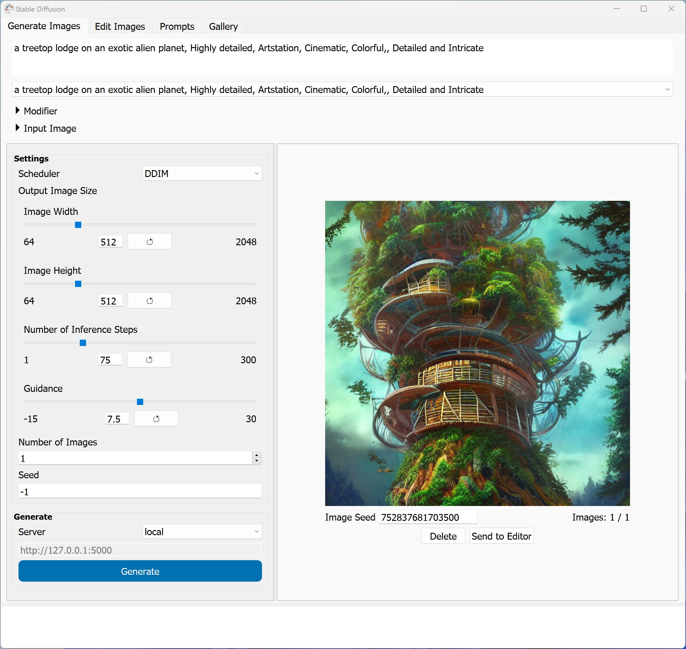

# Stable Diffusion GUI

This repo is my work in getting a functional and feature-rich GUI working for Stable Diffusion on the three major desktop OSes — Windows, macOS, and Linux. All the development and testing was done on Apple Silicon macs, but the code does work on Windows and Linux as well. It has been tested under Windows and Linux, but not extensively — if you find bugs, please do let me know and I'll fix them 🙂

The aim of the GUI is to keep things as simple as possible and yet provide as many features as is necessary to get your work done should you do a lot of image generation using Stable Diffusion. The original aim was to keep the Python package requirements as low (and simple) as possible while providing a GUI that works  on a Mac, Linux, or Windows. However, the package requirements might change as more functionality is added to the GUI.

**Note:** All development has been done on an Apple Silicon Mac and this has been optimized for Apple Silicon. It does work on Intel Macs as well but look at the [Installation Errors](#installation-errors) section below for help if things go wrong with the installation. Also, on a 2017 MacBook Pro, it took about 40 minutes to generate a single image if you did the image generation locally! But, you can run the GUI locally and have the image generation happen remotely (on a different machine with a GPU, for example) to get much faster image generation.


|  |  |  |
| -------------------------------------------------------- | ------------------------------------------------------- | ------------------------------------------------------- |
| **macOS**                                                | **Windows**                                             | **Linux**                                               |

The GUI currently has the following functionality:

* Generate images via just a text prompt or a text prompt + image (either txt2img or img2img)

* Remember all the prompts you've used in the past and allows you to manage them via a simple interface

* Allows you to add modifiers (such as artists, art styles etc.) to your prompts, provides a built-in list of modifiers, and allows you to manage the list of modifiers and modifier categories. You can add as many new modifiers as you want or organize them as you want.

  

* You can use the default Standard Diffusion scheduler/sampler or select another scheduler/sampler from the available list.

* You can specify the size of the image that you want to generate

* Remembers the last settings (and prompt) you used the next time you run the app

* Can generate more than one image at a time and allows you to view all generated images in the GUI

* Saves all generated images and the accompanying prompt info to local storage.

* Allows you to delete any image and its prompt info from within the GUI itself

* Shows you the seed for any image so that you can use that seed to generate image variants

* Allows you to run the GUI locally but run a server elsewhere so that you can connect to the server from the GUI and do image generation on the server — great for when your local machine isn't powerful enough for SD but you still want the convenience of the GUI locally.

* Shows a log of all console output and errors within the app itself so that you can see what is going on without having to go back to the console to see what happened.

* Has a built-in basic editor so that you can create basic prompt images or create masks from a generated image for inpainting.

  

* Allows you to in/outpaint images from within the image editor interface.

* Has a built-in image gallery which shows you all images in the app output folder and if the images were generated from within the app, also shows creation and prompt information for those images.

  

## Installation

Before you start your installation, you might also want to sign up at [Hugging Face](https://huggingface.co/) since you'll need a Hugging Face user account in order to download the Stable Diffusion models. Do note also that you would need to visit the [Hugging Face Stable Diffusion model page](https://huggingface.co/CompVis/stable-diffusion-v1-4) and accept their license before you would be able to download the model — you'll need to download the model during the installation.

There's also an [Installation Errors](#installation-errors) section further down in this document. Please refer to that if you run into issues since common issues that others have faced are documented there 🙂

To get set up, you'll need to run the following commands in terminal one at a time. Do note that some of these commands would require you to make decisions and respond to prompts. If you are not comforable with that, this process might not be for you and you might wan to try one of the one-click installers [listed here](https://www.reddit.com/r/StableDiffusion/comments/xi83vo/stable_diffusion_guis_for_apple_silicon/) 🙂

For installation instructions for each OS, refer to the relevant OS sub-document below for installation instructions. The sub-documents are a work in progress and will be updated over time as I test fully on each OS:

* [macOS](docs/macos.md)

* [Windows](docs/windows.md)

* [Linux](docs/linux.md)

## Running the GUI

Once you've complted the installation following the installation instructions above, if you are still at the terminal, simply type the following to launch the UI:

```bash
python app.py
```

If you closed the terminal or want to use the UI at some other point, you'd have to navigate back to where you have this repo (`sd-gui`) before you run the above command. 

**Note:** If you are not familiar with conda, do note that every time you close your terminal, your Python environment will revert to the base environment when you next start a terminal session. 

The base environment does not have all the packages you installed above since those are in the `ml` environment. So you have to switch to that environment (and navigate to the `sd-gui` folder) before you can run the GUI again. So you'll need to run something like the following each time you start a new terminal session:

```bash
conda activate ml
cd sd-gui
python app.py
```

 Of course, in the above, change the `cd sd-gui` to put the actual location of `sd-gui` on your hard disk 🙂

### Running the Server

You can run the server from a terminal/command-line by simply running the following command:

```bash
python server.py
```

This should result in something like the following as output:


Once the server is running, you can connect to it from another machine using the server's IP and the port number 5000. So, if your server IP address is 192.168.0.11 as in the above screenshot, then run the GUI on your local machine, set the Server to Remote and then enter the IP and port number as follows before you generate an image:


## Using the GUI

There are tooltips for most UI elements explaining what they do. Just hover your mouse cursor ove a UI element like a button or combobox and a tooltip should appear explaining what that particular item does.

I will add more detailed how-tos for tasks later on once I can find some time 🙂 (Or, if you'd like to contribute, add to the documentation and send me a pull request on GitHub and I'll merge the changes in.)

## Installation Errors

* If you get a Homebrew error like this: `homebrew-core is a shallow clone` then run the following command in terminal:

  ```bash
  git -C /usr/local/Homebrew/Library/Taps/homebrew/homebrew-core fetch --unshallow
  ```

* During the conda install it should prompt you to update your system settings to add the conda installation path to your system path. If you didn't do this, then you would have to manually update your .zshrc or .bashrc to add conda to your path. [This StackOverflow question](https://stackoverflow.com/questions/60896426/adding-conda-to-the-path-on-macos-catalina) might help. If not, please Google and let me know if you find a good link 🙂

* If installing the Python packages fails due to conflicting dependencies, use the following commands to create an environment with a known set of package versions. (Since the PyTorch nigthly builds will have fixes for Apple Silicon, if you are on Apple Silicon, the recommended method would be to install the latest night. But if that fails, this should work...) But do this only after you've cloned this repo and have changed your folder into the repo folder.

  ```bash
  conda activate base
  conda env remove -n ml
  conda env create -f environment.yaml
  ```

* If you get the following error:

  ```
  The operator 'aten::index.Tensor' is not current implemented for the MPS device. If you want this op to be added in priority during the prototype phase of this feature, please comment on https://github.com/pytorch/pytorch/issues/77764. As a temporary fix, you can set the environment variable `PYTORCH_ENABLE_MPS_FALLBACK=1` to use the CPU as a fallback for this op. WARNING: this will be slower than running natively on MPS.
  ```

  Then you are not running PyTorch nigthly. You can fix this one of two ways: 

  1) You can create an environment variable to fix the issue. In terminal, run the following:

     ```bash
     export PYTORCH_ENABLE_MPS_FALLBACK=1
     ```

  2) Update your PyTorch to the latest nightly. Again, in terminal run the following:

     ```bash
     conda install pytorch torchvision torchaudio -c pytorch-nightly
     --force-reinstall
     ```

     The above should force your PyTorch to be updated to the latest nightly build.

* If you get either of the following errors:

  ```
  ImportError: cannot import name 'EntryNotFoundError' from 'huggingface_hub.utils'
  ```

  Or:

  ```
  ImportError: cannot import name 'StableDiffusionImg2ImgPipeline' from 'diffusers.pipelines'
  ```

  Then try running the following command from terminal:

  ```bash
  pip install diffusers --force-reinstall --no-cache-dir
  ```

  That should re-install diffusers and fix the issue.

## Known Issues

* You will not see any output in the in-app logging to console at the moment. If everything is working correctly and you do want to see loggin in the app,  open the `app.py` file in a text editor and remove the  comment from the following line in `app.py`:

  ```python
  sys.stdout = sys.stderr = LogStream(queue)
  ```

  If you do have a crash later, this will disable full crash logging in the console. So if that happens, go back and comment out the line above again and run the code again to get the full crash details so that you can report the crash to me 🙂

* The latest Pytorch nightly (1.13.0.dev20220930) appears to be much slower in generating images on an Apple Silicon machine than the previous Pytorch nightly that I used (1.13.0.dev20220922). I don't know if this is a permanent situation or something that will get fixed in the future. I tried setting up conda to install using the particular nightly version that is faster (at least for me) but conda could not find that particular build — if you have a solution for that, please let me know. If you do want to switch to the faster Pytorch nightly version, the only way I know of is to run the folloiwng command *after* you've completed the installation as detailed above:

  ```bash
  pip install --pre -r requirements.txt -f https://download.pytorch.org/whl/nightly/torch_nightly.html
  ```

* ~~You get an error message saying: "[indices should be either on cpu or on the same device as the indexed tensor (cpu)](https://github.com/huggingface/diffusers/issues/239)" Know issue that has been reported to Hugging Face. Read the issue comments to see [how it can be fixed](https://github.com/huggingface/diffusers/issues/239#issuecomment-1236092655) by modifying the diffusers source code ...~~(Fixed in the latest Hugging Face diffusers dev branch. Should be out with diffusers 0.4.0)

* ~~You get an error saying: "[Cannot convert a MPS Tensor to float64 dtype as the MPS framework doesn't support float64. Please use float32 instead](https://github.com/huggingface/diffusers/issues/358)" Known issue that has been reported to Hugging Face. Read the issue comments to see [how it can be fixed](https://github.com/huggingface/diffusers/issues/358#issue-1361673427) by modifying the diffusers source code ...~~ (Appears to have been a PyTorch nightly issue.)

* ~~If you try to generate an image using both an image and a text prompt, you'll get a brown image as the result. This used to work previously but is broken in the diffusers 0.3.0 release. [Issue reported](https://github.com/huggingface/diffusers/issues/462).~~ (Appears to have been a PyTorch nightly issue.)

## FAQ (Frequently Asked Questions)

* **Does this support model 'x'?** No, the base package does not support any other models besides the [Hugging Face diffusers Stable Diffusion model](https://huggingface.co/CompVis/stable-diffusion-v1-4).
* **Why does this use a different Stable Diffusion model than distribution 'x'?** Because my code uses the [Hugging Face diffusers](https://github.com/huggingface/diffusers) code to implement Stable Diffusion and others probably used the [CompVis codebase](https://github.com/CompVis/stable-diffusion).
* **I get a "ModuleNotFoundError: No module named 'x'" error. What do I do?** This generally means that a required Python package is not installed in your current conda environment. If you Google the error with the module name, it should generally show you a search result which tells you how to install the missing package. This generally involves running the command "pip install" with a package name after that.
* **Why is this slower than distribution 'x'?** This could be due to multiple reasons: 1) you have a mix of Python packages which have issues and the same issues are not there with the other distribution 2) the other distribution is inherently faster than this one 3) you are running on CPU instead of GPU for this distribution due to some issue.
* **Why is it so hard to get things working?** The GUI code depends on various Python packages. Some of these Python packages have dependencies where they require a specific version of another package. Getting all of these to work together is generally tricky. It's a matter of keeping on trying till you find the right combination of stuff, figure out all the errors, and get everything to install correctly. Or you can just give up 😛
* **Does this only work on NVIDIA GPUs or Apple M1 machines?** No, the code should run on any device running Windows, macOS, or Linux, whether there's an NVIDIA GPU or not, or whether it's a mac with Apple Silicon or Intel CPU. But the speed at which images will be generated will vary depending on whetther you are on Apple Silicon vs Intel or have a supported GPU vs. no supported GPU.
* **Do you have any benchmarks for how fast this will run on hardware 'x'?** I don't have benchmarks for specific hardware, sorry. I can tell you that I generally get about 1.3it/s on an M1 Max MBP with 32GB of RAM and that others have reported 32s/it on a 2017 Intel MBP, 4s/it on an i9 Intel MBP etc. None of these are averages over multiple iterations — just single-run observations.
* **How can I use the remote server feature with distribution 'x'?** Currently, the remote server feature works with the server from my own codebase. Basically, you run the server part on one machine (which might have a fast GPU) and use the GUI from another machine which might be slower. I am looking into supporting other distributions but can't make any promises just yet.

## Credit

* A good portion of the drawing/canvas handling code comes from [UnstableFusion](https://github.com/ahrm/UnstableFusion/).

* Other inspiration for the editor comes from [Piecasso](https://github.com/pythonguis/15-minute-apps/tree/master/paint)

* The outpainting code/implementation comes from [stablediffusion-infinity](https://github.com/lkwq007/stablediffusion-infinity).

  
