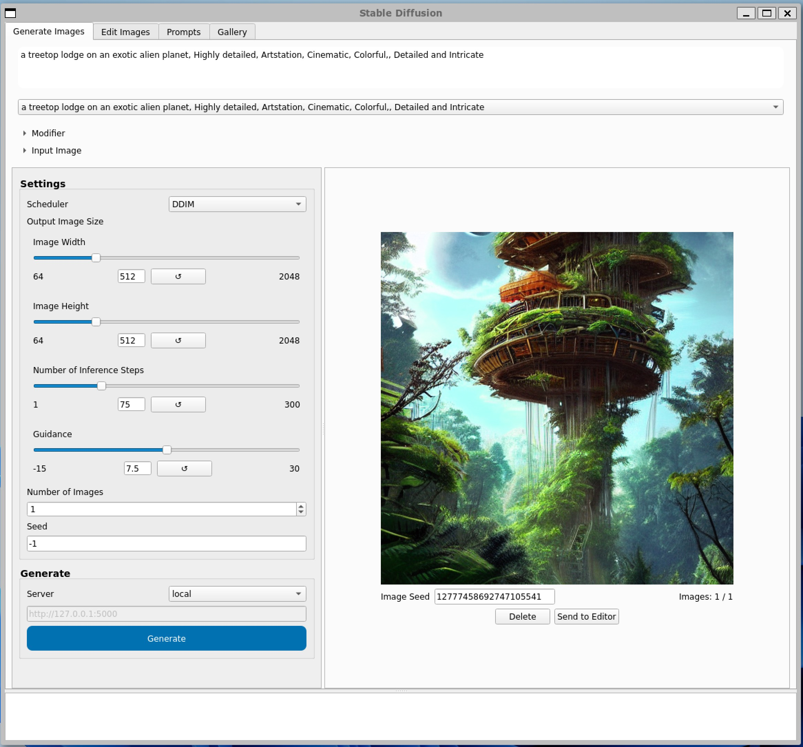
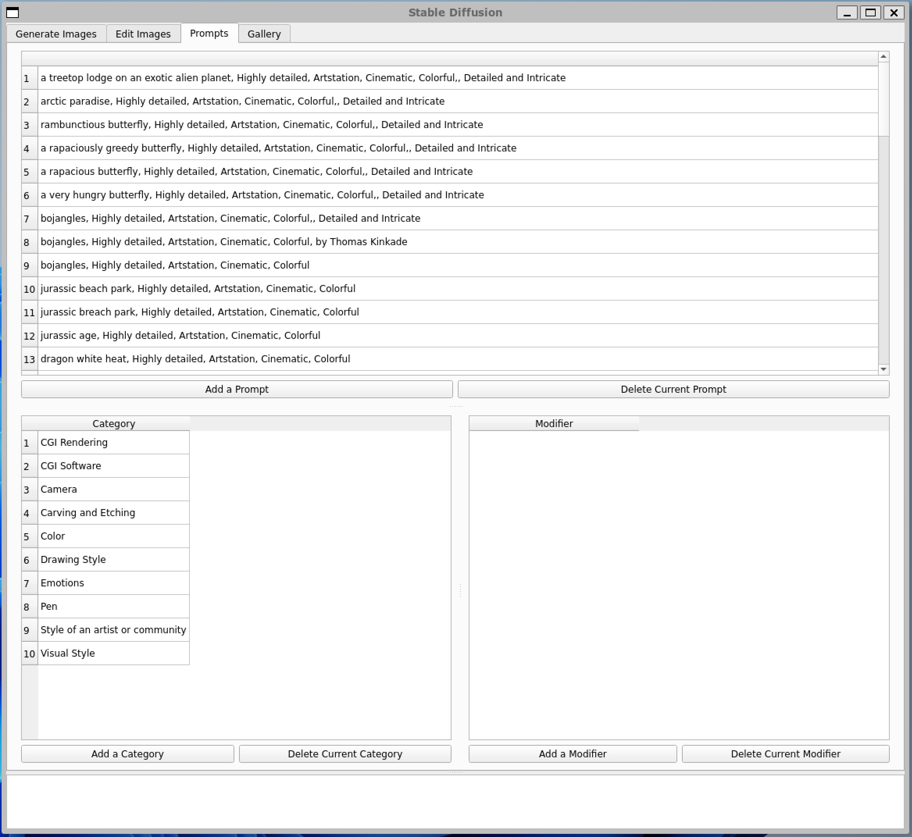

# Linux Installation

If you are familiar with Python, minconda, and the terminal and have git and git-lfs installed, you should be able to get going by using the following commands (or variants thereof):

```bash
# Create and activate new conda environment named ml
conda config --append channels conda-forge
conda create -n ml python=3.9.13
conda activate ml

# Install the needed Python packages
conda install torch -c pytorch-nightly
conda install pyqt
conda install -c conda-forge transformers diffusers ftfy flask scipy
pip install opencv-python scikit-image

# Clone this repo and create output folder
git clone https://github.com/FahimF/sd-gui.git
cd sd-gui
mkdir output

# Clone the Hugging Face model repo - you will need the Hugging Face user and password for this step
git lfs install
git clone https://huggingface.co/CompVis/stable-diffusion-v1-4
```

# Linux Screenshots

Here are some screenshots of the GUI that you'll be able to see after all of that effort 🙂

|                        |
| :----------------------------------------------------------: |
|              The main tab for generating images              |
|                    |
|   The editor tab for in/outpainting or doing basic editing   |
|                  |
|      The prompts tab for editing prompts and modifiers       |
|                  |
| The gallery tab for viewing all output images and their prompts |

