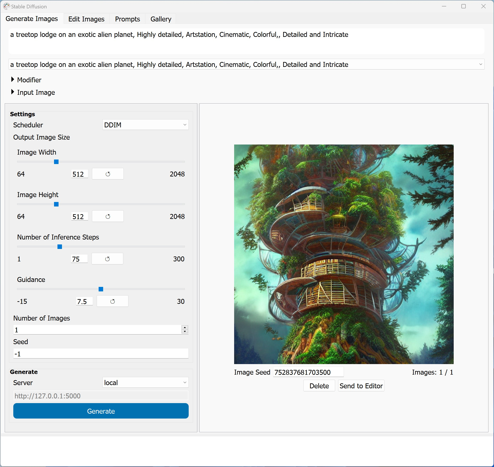
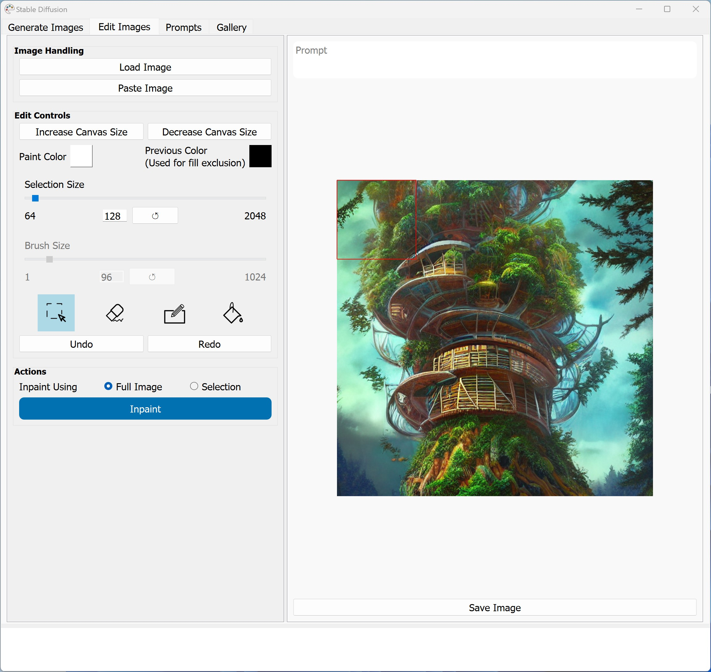
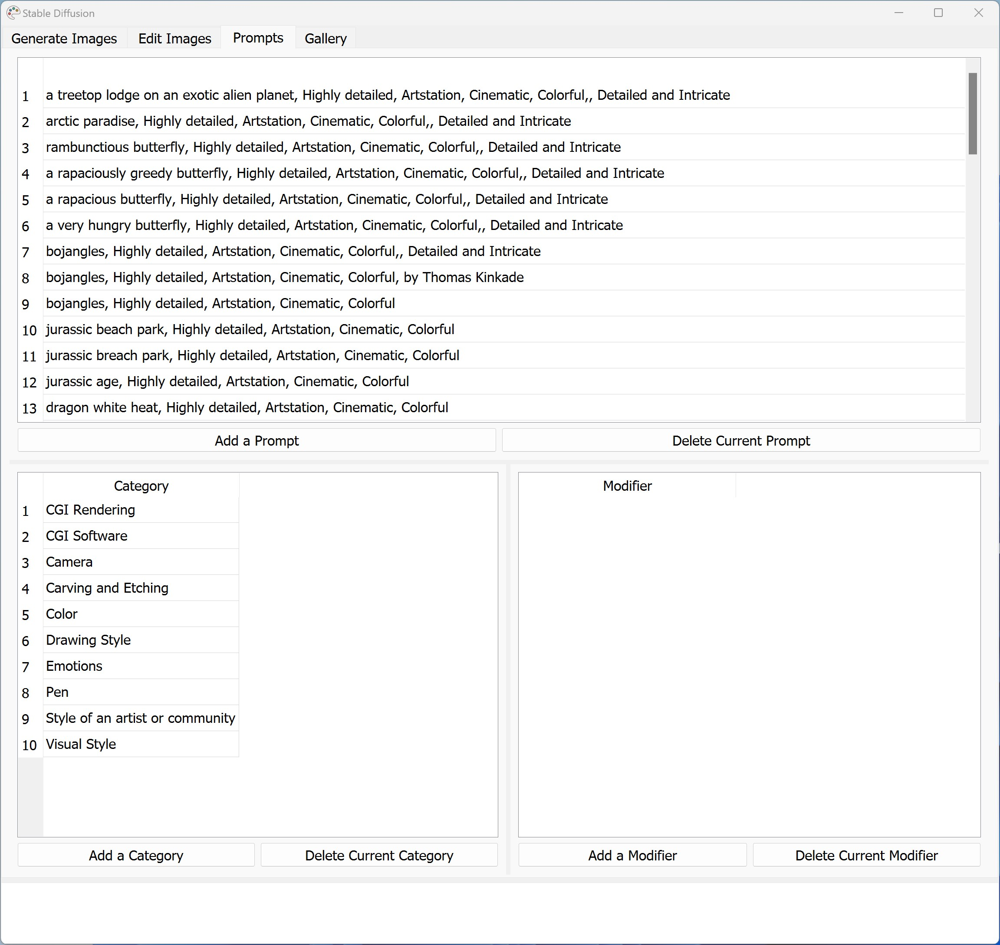
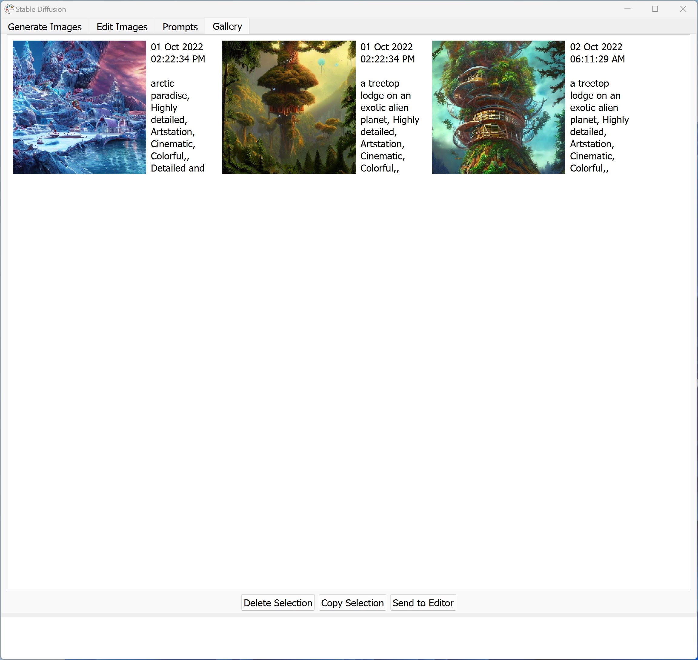

# Windows Installation

There are some pre-requisites that must be in place before you can install the SD GUI code and run it.

## Pre-requisites

You might not need all of the following pre-requisites, but it might be helpful to have them in place before you try to install the app. But if you are familiar with the command-line and know what you are doing, feel free to pick and choose as necessary 🙂

Also do note that you might have these already installed. If so, then you don't have to do anything. The following instructions in this section are for people who have pristine systems which do not have the pre-requisites installed.

### miniconda

[Miniconda](https://docs.conda.io/en/latest/miniconda.html) is an installer/package manager for Python. It allows you to have multiple environments for different Python apps/tasks and to be able to mix and match different Python versions as required.

You can download the Miniconda installer for your OS platform from this page:

https://docs.conda.io/en/latest/miniconda.html

Note that there are a lot of options (and different OS versions) on that page. So make sure to go through the full list and pick the right version of the installer 🙂

While you don't strictly need Miniconda to install the SD GUI app, having it installed will make your life easier and prevent you messing up your existing Python install and packages, or running into various version conflicts with any of your existing installs.

### Git (and git-lfs)

[Git](https://git-scm.com/) is a version control system. Basically, it's what coders use to manage the different versions of their source code. So why do you need it? Because GitHub uses Git and so you'll need to use Git in order to download the code for the SD GUI repo (short for repository) and and to get the SD model data, which is in a different repo.

Git-lfs adds large file support so that you can download large files in an optimized fashion from a Git repo. Since the SD model is stored using git-lfs, you will need git-lfs to corectly download the data from the SD repo.

You can download the installer for Git from here:

https://git-scm.com/download/win

### CUDA Toolkit

If you have an NVIDIA graphics card, you will need the CUDA Toolkit installed in order to use your GPU from your Python code. If you don't have the CUDA Toolkit installed, go here and follow the instructiont to install the CUDA Toolkit:

https://developer.nvidia.com/cuda-downloads

**Note:** The Pytorch version you install has to match your CUDA Toolkit version. Otherwise, the GUI will run on the CPU rather than the GPU and it will be much slower. To determine the CUDA Toolkit version, you can run the folllowing command via terminal:

```bash
nvidia-smi
```

The number along with "CUDA Version:" in the top right of the output you get is your CUDA Toolkit version. While the instructions below tell you how to install Pytorch, your easiest bet to get things right (to match your CUDA Toolkit version) would be to go here and find the exact command you need by selecting your CUDA Tookit version under "Compute Platform" to get the right command:

https://pytorch.org/get-started/locally/

That's it! You should now be set for installing and running the code from this repo 🙂

## Installation

If you are familiar with Python, minconda, and the terminal and have git and git-lfs installed, you should be able to get going by using the following commands (or variants thereof) from a command prompt. 

**Note:** Make sure to be in the folder where you want the code to be placed before you run the following commands.

```bash
# Create and activate new conda environment named ml
conda config --append channels conda-forge
conda create -n ml python=3.9.13
conda activate ml

# Install the needed Python packages
conda install pyqt
# The following command is for CUDA Toolkit 11.7. Go to https://pytorch.org/get-started/locally/ and find the correct commadn matching your CUDA Toolkit version
conda install pytorch torchvision torchaudio pytorch-cuda=11.7 -c pytorch-nightly -c nvidia
conda install -c conda-forge transformers diffusers ftfy flask scipy
pip install opencv-python scikit-image darkdetect

# Clone this repo and create output folder
git clone https://github.com/FahimF/sd-gui.git
cd sd-gui
mkdir output

# Clone the Hugging Face model repo - you will need the Hugging Face user and password for this step
git lfs install
git clone https://huggingface.co/CompVis/stable-diffusion-v1-4
```

# Windows Screenshots

Here are some screenshots of the GUI that you'll be able to see after all of that effort 🙂

|                        |
| :----------------------------------------------------------: |
|              The main tab for generating images              |
|                    |
|   The editor tab for in/outpainting or doing basic editing   |
|                  |
|      The prompts tab for editing prompts and modifiers       |
|                  |
| The gallery tab for viewing all output images and their prompts |

